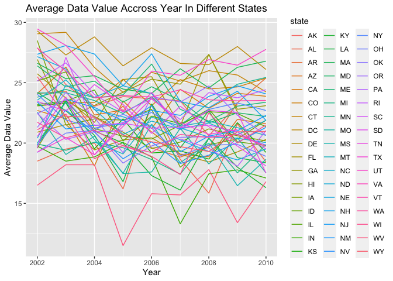

p8105_hw3
================
Qianying Wu
2023-10-12

## Problem 1

``` r
library(p8105.datasets)
data("instacart")
```

## Problem 2

### Data cleaning

- format the data to use appropriate variable names;
- focus on the “Overall Health” topic
- include only responses from “Excellent” to “Poor”
- organize responses as a factor taking levels ordered from “Poor” to
  “Excellent”

``` r
library(p8105.datasets)
data("brfss_smart2010")
brfss = brfss_smart2010 |> 
  janitor::clean_names() |>
  filter(topic == "Overall Health", response == "Excellent" | response == "Poor") |>
  mutate(forcats::fct_relevel(response, "Poor", "Excellent")) |> 
  rename(state = locationabbr, county = locationdesc)
head(brfss)
```

    ## # A tibble: 6 × 24
    ##    year state county        class topic question response sample_size data_value
    ##   <int> <chr> <chr>         <chr> <chr> <chr>    <chr>          <int>      <dbl>
    ## 1  2010 AL    AL - Jeffers… Heal… Over… How is … Excelle…          94       18.9
    ## 2  2010 AL    AL - Jeffers… Heal… Over… How is … Poor              45        5.5
    ## 3  2010 AL    AL - Mobile … Heal… Over… How is … Excelle…          91       15.6
    ## 4  2010 AL    AL - Mobile … Heal… Over… How is … Poor              66        6.4
    ## 5  2010 AL    AL - Tuscalo… Heal… Over… How is … Excelle…          58       20.8
    ## 6  2010 AL    AL - Tuscalo… Heal… Over… How is … Poor              35        4.2
    ## # ℹ 15 more variables: confidence_limit_low <dbl>, confidence_limit_high <dbl>,
    ## #   display_order <int>, data_value_unit <chr>, data_value_type <chr>,
    ## #   data_value_footnote_symbol <chr>, data_value_footnote <chr>,
    ## #   data_source <chr>, class_id <chr>, topic_id <chr>, location_id <chr>,
    ## #   question_id <chr>, respid <chr>, geo_location <chr>,
    ## #   `forcats::fct_relevel(response, "Poor", "Excellent")` <fct>

1.  In 2002, which states were observed at 7 or more locations? What
    about in 2010?

``` r
state_2002 <- brfss |> filter(year == "2002") 


state_2002_7 = state_2002 |> 
  group_by(state) |>
  count(state, name = "n_obs") |>
  filter(n_obs >= 7) 

state_2002_7
```

    ## # A tibble: 17 × 2
    ## # Groups:   state [17]
    ##    state n_obs
    ##    <chr> <int>
    ##  1 CO        8
    ##  2 CT       14
    ##  3 FL       14
    ##  4 HI        8
    ##  5 MA       16
    ##  6 MD       12
    ##  7 MI        8
    ##  8 MN        8
    ##  9 NC       14
    ## 10 NH       10
    ## 11 NJ       16
    ## 12 NY       10
    ## 13 OH        8
    ## 14 PA       20
    ## 15 RI        8
    ## 16 UT       10
    ## 17 WA        8

``` r
state_2010 <- brfss |> filter(year == "2010") 


state_2010_7 = state_2010 |> 
  group_by(state) |>
  count(state, name = "n_obs") |>
  filter(n_obs >= 7) 

state_2010_7
```

    ## # A tibble: 30 × 2
    ## # Groups:   state [30]
    ##    state n_obs
    ##    <chr> <int>
    ##  1 CA       24
    ##  2 CO       14
    ##  3 CT       10
    ##  4 FL       82
    ##  5 GA        8
    ##  6 HI        8
    ##  7 ID       12
    ##  8 KS        8
    ##  9 LA       10
    ## 10 MA       18
    ## # ℹ 20 more rows

- According to the result, we know that in 2002, the states CO, CT, FL,
  HI, MA, MD, MI, MN, NC, NH, NJ, NY, OH, PA, RI, UT, and WA were
  observed at 7 or more locations.

- In 2010, the states “CA” “CO” “CT” “FL” “GA” “HI” “ID” “KS” “LA” “MA”
  “MD” “ME” “MI” “MN” “NC” “NE” “NH” “NJ” “NM” “NY” “OH” “OR” “PA” “RI”
  “SC” “TN” “TX” “UT” “VT” “WA” were observed at 7 or more locations.

2.  Construct a dataset that is limited to Excellent responses, and
    contains, year, state, and a variable that averages the data_value
    across locations within a state. Make a “spaghetti” plot of this
    average value over time within a state (that is, make a plot showing
    a line for each state across years – the geom_line geometry and
    group aesthetic will help).

``` r
excellent_data <- brfss |>
  filter(response == "Excellent") |>
  select(year, state, data_value)

# Calculate the average data value within each state for each year
average_data_by_state <- excellent_data |>
  group_by(year, state) |>
  summarise(average = mean(data_value))
```

    ## `summarise()` has grouped output by 'year'. You can override using the
    ## `.groups` argument.

``` r
average_data_by_state
```

    ## # A tibble: 443 × 3
    ## # Groups:   year [9]
    ##     year state average
    ##    <int> <chr>   <dbl>
    ##  1  2002 AK       27.9
    ##  2  2002 AL       18.5
    ##  3  2002 AR       24.1
    ##  4  2002 AZ       24.1
    ##  5  2002 CA       22.7
    ##  6  2002 CO       23.1
    ##  7  2002 CT       29.1
    ##  8  2002 DC       29.3
    ##  9  2002 DE       20.9
    ## 10  2002 FL       25.7
    ## # ℹ 433 more rows

``` r
# Create a "spaghetti" plot
ggplot(average_data_by_state, aes(x = year, y = average, group = state, color = state)) +
  geom_line() +
  labs(
    x = "Year",
    y = "Average Data Value",
    title = "Average Data Value Accross Year In Different States"
  )
```

    ## Warning: Removed 3 rows containing missing values (`geom_line()`).

<!-- -->
