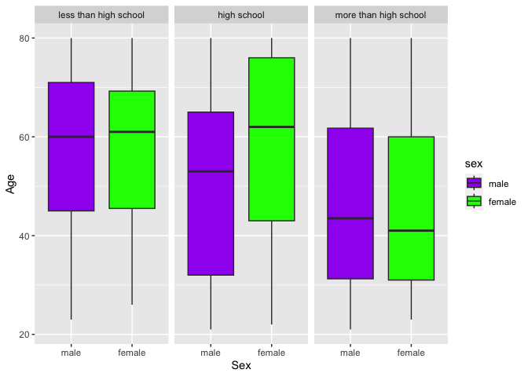

p8105_hw3
================
Qianying Wu
2023-10-12

## Problem 1

## Problem 1

#### Read in the data

``` r
data("instacart")

instacart = 
  instacart |> 
  as_tibble()
```

#### Answer questions about the data

This dataset contains 1384617 rows and 15 columns, with each row
resprenting a single product from an instacart order. Variables include
identifiers for user, order, and product; the order in which each
product was added to the cart. There are several order-level variables,
describing the day and time of the order, and number of days since prior
order. Then there are several item-specific variables, describing the
product name (e.g. Yogurt, Avocado), department (e.g. dairy and eggs,
produce), and aisle (e.g. yogurt, fresh fruits), and whether the item
has been ordered by this user in the past. In total, there are 39123
products found in 131209 orders from 131209 distinct users.

Below is a table summarizing the number of items ordered from aisle. In
total, there are 134 aisles, with fresh vegetables and fresh fruits
holding the most items ordered by far.

``` r
instacart |> 
  count(aisle) |> 
  arrange(desc(n))
```

    ## # A tibble: 134 × 2
    ##    aisle                              n
    ##    <chr>                          <int>
    ##  1 fresh vegetables              150609
    ##  2 fresh fruits                  150473
    ##  3 packaged vegetables fruits     78493
    ##  4 yogurt                         55240
    ##  5 packaged cheese                41699
    ##  6 water seltzer sparkling water  36617
    ##  7 milk                           32644
    ##  8 chips pretzels                 31269
    ##  9 soy lactosefree                26240
    ## 10 bread                          23635
    ## # ℹ 124 more rows

Next is a plot that shows the number of items ordered in each aisle.
Here, aisles are ordered by ascending number of items.

``` r
instacart |> 
  count(aisle) |> 
  filter(n > 10000) |> 
  mutate(aisle = fct_reorder(aisle, n)) |> 
  ggplot(aes(x = aisle, y = n)) + 
  geom_point() + 
  labs(title = "Number of items ordered in each aisle") +
  theme(axis.text.x = element_text(angle = 60, hjust = 1))
```

<!-- -->

Our next table shows the three most popular items in aisles
`baking ingredients`, `dog food care`, and `packaged vegetables fruits`,
and includes the number of times each item is ordered in your table.

``` r
instacart |> 
  filter(aisle %in% c("baking ingredients", "dog food care", "packaged vegetables fruits")) |>
  group_by(aisle) |> 
  count(product_name) |> 
  mutate(rank = min_rank(desc(n))) |> 
  filter(rank < 4) |> 
  arrange(desc(n)) |>
  knitr::kable()
```

| aisle                      | product_name                                  |    n | rank |
|:---------------------------|:----------------------------------------------|-----:|-----:|
| packaged vegetables fruits | Organic Baby Spinach                          | 9784 |    1 |
| packaged vegetables fruits | Organic Raspberries                           | 5546 |    2 |
| packaged vegetables fruits | Organic Blueberries                           | 4966 |    3 |
| baking ingredients         | Light Brown Sugar                             |  499 |    1 |
| baking ingredients         | Pure Baking Soda                              |  387 |    2 |
| baking ingredients         | Cane Sugar                                    |  336 |    3 |
| dog food care              | Snack Sticks Chicken & Rice Recipe Dog Treats |   30 |    1 |
| dog food care              | Organix Chicken & Brown Rice Recipe           |   28 |    2 |
| dog food care              | Small Dog Biscuits                            |   26 |    3 |

Finally is a table showing the mean hour of the day at which Pink Lady
Apples and Coffee Ice Cream are ordered on each day of the week. This
table has been formatted in an untidy manner for human readers. Pink
Lady Apples are generally purchased slightly earlier in the day than
Coffee Ice Cream, with the exception of day 5.

``` r
instacart |>
  filter(product_name %in% c("Pink Lady Apples", "Coffee Ice Cream")) |>
  group_by(product_name, order_dow) |>
  summarize(mean_hour = mean(order_hour_of_day)) |>
  pivot_wider(
    names_from = order_dow, 
    values_from = mean_hour) |>
  knitr::kable(digits = 2)
```

    ## `summarise()` has grouped output by 'product_name'. You can override using the
    ## `.groups` argument.

| product_name     |     0 |     1 |     2 |     3 |     4 |     5 |     6 |
|:-----------------|------:|------:|------:|------:|------:|------:|------:|
| Coffee Ice Cream | 13.77 | 14.32 | 15.38 | 15.32 | 15.22 | 12.26 | 13.83 |
| Pink Lady Apples | 13.44 | 11.36 | 11.70 | 14.25 | 11.55 | 12.78 | 11.94 |

## Problem 2

### Data cleaning

- format the data to use appropriate variable names;
- focus on the “Overall Health” topic
- include only responses from “Excellent” to “Poor”
- organize responses as a factor taking levels ordered from “Poor” to
  “Excellent”

``` r
library(p8105.datasets)
data("brfss_smart2010")
brfss = brfss_smart2010 |> 
  janitor::clean_names() |>
  filter(topic == "Overall Health") |>
  mutate(response = fct_relevel(response, "Poor", "Fair", "Good", "Very good", "Excellent")) |> 
  rename(state = locationabbr, county = locationdesc)

brfss
```

    ## # A tibble: 10,625 × 23
    ##     year state county       class topic question response sample_size data_value
    ##    <int> <chr> <chr>        <chr> <chr> <chr>    <fct>          <int>      <dbl>
    ##  1  2010 AL    AL - Jeffer… Heal… Over… How is … Excelle…          94       18.9
    ##  2  2010 AL    AL - Jeffer… Heal… Over… How is … Very go…         148       30  
    ##  3  2010 AL    AL - Jeffer… Heal… Over… How is … Good             208       33.1
    ##  4  2010 AL    AL - Jeffer… Heal… Over… How is … Fair             107       12.5
    ##  5  2010 AL    AL - Jeffer… Heal… Over… How is … Poor              45        5.5
    ##  6  2010 AL    AL - Mobile… Heal… Over… How is … Excelle…          91       15.6
    ##  7  2010 AL    AL - Mobile… Heal… Over… How is … Very go…         177       31.3
    ##  8  2010 AL    AL - Mobile… Heal… Over… How is … Good             224       31.2
    ##  9  2010 AL    AL - Mobile… Heal… Over… How is … Fair             120       15.5
    ## 10  2010 AL    AL - Mobile… Heal… Over… How is … Poor              66        6.4
    ## # ℹ 10,615 more rows
    ## # ℹ 14 more variables: confidence_limit_low <dbl>, confidence_limit_high <dbl>,
    ## #   display_order <int>, data_value_unit <chr>, data_value_type <chr>,
    ## #   data_value_footnote_symbol <chr>, data_value_footnote <chr>,
    ## #   data_source <chr>, class_id <chr>, topic_id <chr>, location_id <chr>,
    ## #   question_id <chr>, respid <chr>, geo_location <chr>

``` r
#brfss = brfss_ori |> filter(response == "Excellent" | response == "Poor")
#head(brfss_ori)
```

1.  In 2002, which states were observed at 7 or more locations? What
    about in 2010?

``` r
state_2002 <- brfss |> filter(year == "2002") 


state_2002_7 = state_2002 |> 
  group_by(state) |>
  summarise(occurences = n_distinct(county)) |>
  filter(occurences >= 7)

state_2002_7
```

    ## # A tibble: 6 × 2
    ##   state occurences
    ##   <chr>      <int>
    ## 1 CT             7
    ## 2 FL             7
    ## 3 MA             8
    ## 4 NC             7
    ## 5 NJ             8
    ## 6 PA            10

``` r
state_2010 <- brfss |> filter(year == "2010") 


state_2010_7 = state_2010 |> 
  group_by(state) |>
  summarise(occurences = n_distinct(county)) |>
  filter(occurences >= 7)

state_2010_7
```

    ## # A tibble: 14 × 2
    ##    state occurences
    ##    <chr>      <int>
    ##  1 CA            12
    ##  2 CO             7
    ##  3 FL            41
    ##  4 MA             9
    ##  5 MD            12
    ##  6 NC            12
    ##  7 NE            10
    ##  8 NJ            19
    ##  9 NY             9
    ## 10 OH             8
    ## 11 PA             7
    ## 12 SC             7
    ## 13 TX            16
    ## 14 WA            10

- According to the result, we know that in 2002, the states CT, FL, MA,
  NC, NJ, PA were observed at 7 or more locations.

- In 2010, the states CA, CO, FL, MA, MD, NC, NE, NJ, NY, PA, SC, TX, WA
  were observed at 7 or more locations.

2.  Construct a dataset that is limited to Excellent responses, and
    contains, year, state, and a variable that averages the data_value
    across locations within a state. Make a “spaghetti” plot of this
    average value over time within a state (that is, make a plot showing
    a line for each state across years – the geom_line geometry and
    group aesthetic will help).

``` r
excellent_data <- brfss |>
  filter(response == "Excellent") |>
  select(year, state, data_value)

# Calculate the average data value within each state for each year
average_data_by_state <- excellent_data |>
  group_by(year, state) |>
  summarise(average = mean(data_value))
```

    ## `summarise()` has grouped output by 'year'. You can override using the
    ## `.groups` argument.

``` r
average_data_by_state
```

    ## # A tibble: 443 × 3
    ## # Groups:   year [9]
    ##     year state average
    ##    <int> <chr>   <dbl>
    ##  1  2002 AK       27.9
    ##  2  2002 AL       18.5
    ##  3  2002 AR       24.1
    ##  4  2002 AZ       24.1
    ##  5  2002 CA       22.7
    ##  6  2002 CO       23.1
    ##  7  2002 CT       29.1
    ##  8  2002 DC       29.3
    ##  9  2002 DE       20.9
    ## 10  2002 FL       25.7
    ## # ℹ 433 more rows

``` r
# Create a "spaghetti" plot
ggplot(average_data_by_state, aes(x = year, y = average, group = state, color = state)) +
  geom_line() +
  labs(
    x = "Year",
    y = "Average Data Value",
    title = "Average Data Value Accross Year In Different States"
  )
```

    ## Warning: Removed 3 rows containing missing values (`geom_line()`).

<!-- -->

3.  Make a two-panel plot showing, for the years 2006, and 2010,
    distribution of data_value for responses (“Poor” to “Excellent”)
    among locations in NY State.

``` r
brfss |>
  filter(year %in% c(2006, 2010), 
         state == "NY", 
         response %in% c("Poor", "Fair", "Good", "Very good", "Excellent")) |>
         ggplot(aes(x = response, y = data_value)) +
         geom_boxplot() +
         facet_wrap(~year, ncol = 2) +
          labs(
        x = "Data Value",
        y = "Frequency",
        title = "Distribution of Data Value by Response in NY State (2006 and 2010)",
        fill = "Response"
  )
```

<!-- -->

## Problem 3

1.  Load, tidy, merge, and otherwise organize the data sets. Your final
    dataset should include all originally observed variables; exclude
    participants less than 21 years of age, and those with missing
    demographic data; and encode data with reasonable variable classes
    (i.e. not numeric, and using factors with the ordering of tables and
    plots in mind).

``` r
accel = read_csv("data/nhanes_accel.csv") |>
  janitor::clean_names() |>
  pivot_longer(min1:min1440,
               names_prefix = "min",
               names_to = "minutes",
               values_to = "MIMS")
```

    ## Rows: 250 Columns: 1441
    ## ── Column specification ────────────────────────────────────────────────────────
    ## Delimiter: ","
    ## dbl (1441): SEQN, min1, min2, min3, min4, min5, min6, min7, min8, min9, min1...
    ## 
    ## ℹ Use `spec()` to retrieve the full column specification for this data.
    ## ℹ Specify the column types or set `show_col_types = FALSE` to quiet this message.

``` r
accel
```

    ## # A tibble: 360,000 × 3
    ##     seqn minutes  MIMS
    ##    <dbl> <chr>   <dbl>
    ##  1 62161 1       1.11 
    ##  2 62161 2       3.12 
    ##  3 62161 3       1.47 
    ##  4 62161 4       0.938
    ##  5 62161 5       1.60 
    ##  6 62161 6       0.145
    ##  7 62161 7       2.10 
    ##  8 62161 8       0.509
    ##  9 62161 9       1.63 
    ## 10 62161 10      1.20 
    ## # ℹ 359,990 more rows

``` r
demo = read_csv("data/nhanes_covar.csv", skip = 4) |>
  janitor::clean_names() |>
  drop_na() |>
  filter(age >= 21) |>
  mutate(
    sex = recode(sex, "1" = "male", "2" = "female"),
    education = recode(education, "1" = "less than high school", "2" = "high school", "3" = "more than high school"))
```

    ## Rows: 250 Columns: 5
    ## ── Column specification ────────────────────────────────────────────────────────
    ## Delimiter: ","
    ## dbl (5): SEQN, sex, age, BMI, education
    ## 
    ## ℹ Use `spec()` to retrieve the full column specification for this data.
    ## ℹ Specify the column types or set `show_col_types = FALSE` to quiet this message.

``` r
redemo = demo |>
    mutate(sex = fct_relevel(sex, "male", "female"),
           education = fct_relevel(education, "less than high school", "high school", "more than high school"))

redemo
```

    ## # A tibble: 228 × 5
    ##     seqn sex      age   bmi education            
    ##    <dbl> <fct>  <dbl> <dbl> <fct>                
    ##  1 62161 male      22  23.3 high school          
    ##  2 62164 female    44  23.2 more than high school
    ##  3 62169 male      21  20.1 high school          
    ##  4 62174 male      80  33.9 more than high school
    ##  5 62177 male      51  20.1 high school          
    ##  6 62178 male      80  28.5 high school          
    ##  7 62180 male      35  27.9 more than high school
    ##  8 62184 male      26  22.1 high school          
    ##  9 62189 female    30  22.4 more than high school
    ## 10 62199 male      57  28   more than high school
    ## # ℹ 218 more rows

``` r
nhanes = left_join(redemo,accel,by = "seqn")
```

2.  Produce a reader-friendly table for the number of men and women in
    each education category, and create a visualization of the age
    distributions for men and women in each education category. Comment
    on these items.

``` r
nhanes |> 
  group_by(sex, education) |>
  summarise(total_num = n()/1440) |>
  pivot_wider(
    names_from = sex,
    values_from = total_num
  )  |>
  knitr::kable(caption = "Summary of Participants by Sex and Education")
```

    ## `summarise()` has grouped output by 'sex'. You can override using the `.groups`
    ## argument.

| education             | male | female |
|:----------------------|-----:|-------:|
| less than high school |   27 |     28 |
| high school           |   35 |     23 |
| more than high school |   56 |     59 |

Summary of Participants by Sex and Education

``` r
# Visual distribution

age_distribution_plot <- nhanes |>
  ggplot(aes(x = education, y = age, fill = sex)) +
  geom_boxplot() +
  labs(x = "Education", y = "Age") +
  scale_fill_manual(values = c("male" = "blue", "female" = "red")) +
  facet_wrap(~sex)

print(age_distribution_plot)
```

<!-- -->

- Comment:

On this visualization, it is clear that in the education level of less
than high school, both female and male groups have similar distribution
including their mean age at around 60. The female group has their mean
age slightly larger than the male’s group.

In equivalent to high school education, female group has mean age larger
than 60, which is higher than the mean age of the male group’s
distribution (slightly above 50).

In the more than high school education level, both female and male
groups have similar distributions of age, with male group’s mean age
(around 42) slightly higher than those of the female group (around 41).

From the male groups, we can see that when the education level becomes
higher, the mean age of the male’s group becomes younger. From the
female groups, we observe that for lower than high school and equivalent
to high school groups, the mean age are similar, which is much larger
than the mean age of higher than high school education level.

3.  Traditional analyses of accelerometer data focus on the total
    activity over the day. Using your tidied dataset, aggregate across
    minutes to create a total activity variable for each participant.
    Plot these total activities (y-axis) against age (x-axis); your plot
    should compare men to women and have separate panels for each
    education level. Include a trend line or a smooth to illustrate
    differences. Comment on your plot.
